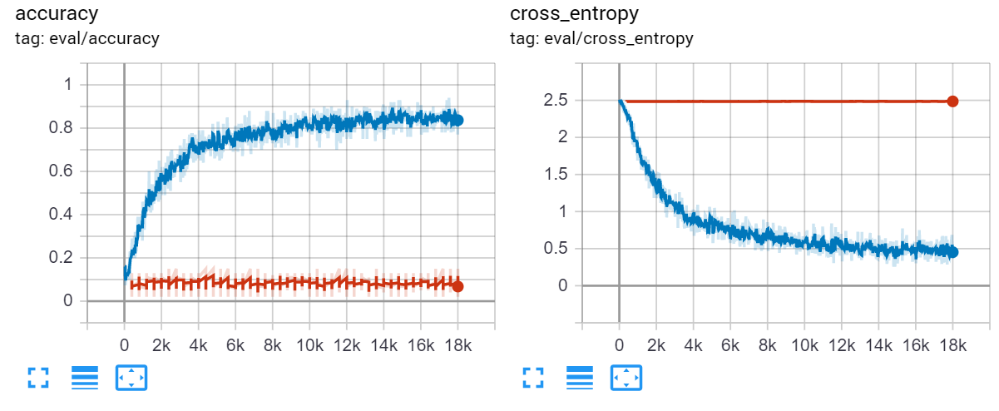
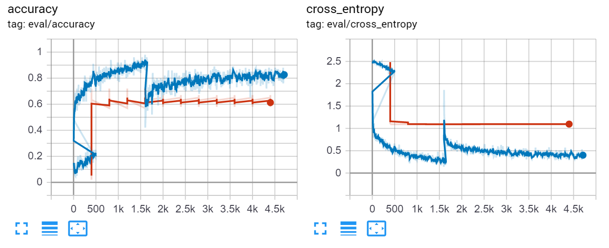

# Model

Given the time constraint and lack of a large dataset, there are 2 avenues to go down for this project, given the time constraint.

#### 1. use VGGish as base 
(https://github.com/tensorflow/models/tree/master/research/audioset)

in this case, there is a pretrained model available, so going off of that immediately could be very convenient. However, given the model architecture, It might be difficult to run in real time. It's also trained for categorizing different types of sounds in general rather than human speech, so not sure how quickly transferable. 

#### 2. use a simple CNN described in http://www.isca-speech.org/archive/interspeech_2015/papers/i15_1478.pdf

Here, I'll have to still train the initial model myself. However, google already has a training system set up (https://www.tensorflow.org/tutorials/sequences/audio_recognition) so that might be easy enough to build on. The performance here might not be state of the art, but this is a hackathon, and I can build on top of this later after a proof of concept.

# Data

the requirement here is an unscript, labeled dataset containing filler words such as um. 
I've thought about using google's or microsoft api to label some audio, but those models sometimes actively ignore filler words. That makes some sense from a design decision, but is entirely useless here.

### found a dataset!

SSPNet Vocalization Corpus (http://www.dcs.gla.ac.uk/vincia/?p=378) contains:

> 2763 audio clips (11 seconds each) containing at least one laughter or filler instance. Overall, the corpus involves 120 subjects (63 females and 57 males). The clips are extracted from phone calls where two fully unacquainted speakers try to solve the Winter Survival Task.

In this case, we're interested in the filler instances. After filtering for that, There are a total of 2988 instances of filler moments in this dataset. Not a whole lot to be training on, but this is the only dataset I was able to find that I could actually access.

~~not including the laugh parts at all so that the final dataset would be balanced ish instead of there being significantly more of non-filler moments. It's still not totally balanced, but that's probably okay. Reflective of actual testing distribution and whatever.~~
It's actually not at all balanced........ note to self: try undersampling the not um's if the initial model doesn't work

Other issue: they speak with british accents. That's likely to mess with the results.

###### alternative datasets:  https://catalog.ldc.upenn.edu/LDC2005S16

### sectioning:

google's predefined model operates on 1 second segments. However, in the dataset, there are 81 instances where the filler segment exceeds 1 second. However, only 10 instances contains more than 2 seconds of filler, so we can use that as a filter

A 2 second sliding window can be used to create many 2 second audio clips. They will be labeled according to whether or not they contain a filler word

#### partials

question: what should I do for 2 second segments which contains a part of a filler word?

- 

### train val split

the validation or testing should contain 2 types of instances:

- the unique person speaking was not included in the training set
- the specific filler instance was not included in the training set

a quick hack was used to make tensorflow's training pipline use my custom train val split

# training

### base model:

after running tensorflow's train script, the validation set is obviously very wrong. 



potential reason: didn't configure tensorflow properly (something something bazel, something something ./configure)

However, the overall shape of the graph seems right. I've also tested with the provided testing options:

with label_wav.py:

```
left (score = 0.80921)
right (score = 0.12201)
_unknown_ (score = 0.04661)
```

with generate_streaming_test_wav

###### warning: this is where I screwed up
spent much too long trying to get this working. Many many hours spent on something that doesn't actually contribute to how this would work, leaving very little time to train my actual model

#### training the actual um detector:

so at this point it's late at night and I realize that the checkooint file cannot automatically accomadate the change in input and output vectors (ie. input is now 2000ms, output is now just a couple of classes)

last minute retraining of the base model. Adjusted unknown_percentage to 50 since there's only a single other class. starts right away with 50% accuracy, with makes sence as there's ony 2 options. Converged somewhat at only 1.6k steps when I stopped it in order to train my actual um model. The lack of reliable validation data is really hurting right now as there isn't really a way to check for overfitting and not enough time to write something up as I still haven't finished figuring out how to get the model to predict on a real time audio stream

in conclusion: bad planning on my part


this incredably messed up graph is the training result. The bit at the start was when I started, then restarted a training run, but couldn't be bothered to remove it. The base model trained for 1.5k steps before switching over to using the um dataset. Later on, I forgot to turn off the training run and I really hope it didn't overfit too badly, but again, validation isn't working. The fact that the model is converging so quickly might be worrying or it might just be because there are so few classes. And data. There isn't enough data. 

However, it does seem to be converging to something, which is good! loss isn't going down. 

# Demo

This section is where I spent both not enough time and at the same time, too much time. The planned demo involved a real time beep as the speaker says a filler word (ie. um). The only inference that's really working is reading 2 second wav files and giving you a result

# improvements

- I have not implemented any data augmentation methods. I should try to do some.
- dataset: find a bigger, more varied dataset with many different accents
- CNN is fine for this use case since I'm only detecting specific sounds. If I want to incorporate other filler words that are actually in use in normal english, such as "like", I'll probably have to do something with recurrent networks or similar so that the model will be able to take into account that time dependancy
- actually have a working demonstration with real time detection. The model is fast enough, theoretically, given the architecture, especially if you run it off a GPU, I just didn't have the time to implement it
